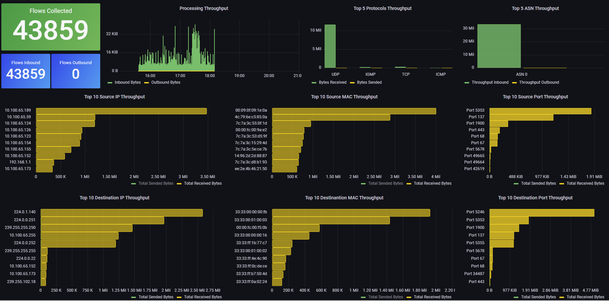

# Net-Flow Dump Appliance

**This repository structures a deployment of NetFlow components (nfdump 1.6.23), Grafana (9.3.2), and Database (MySQL 8.0.34) for NetFlow data processing and presentation.**



---
Prerequisites
Before you begin, ensure you have the following packages installed on your system:

- Git version 2.34.1
- Docker version 24.0.6, build ed223bc
- Docker Compose version v2.21.0

---
### Possible data Fields to collect information about: 

The fields below are avaliable to be collected on database: 

- `ts` (Start Time): The start time of the data flow, indicating when the flow began.
- `te` (End Time): The end time of the data flow, indicating when the flow ended.
- `td` (Total Duration): The total duration of the flow in milliseconds.
- `sa` (Source Address): The source IP address of the data flow.
- `da` (Destination Address): The destination IP address of the data flow.
- `sp` (Source Port): The source port of the data flow.
- `dp` (Destination Port): The destination port of the data flow.
- `pr` (Protocol): The protocol used in the data flow (e.g., TCP, UDP).
- `flg` (Flags): Status indicators of the data flow, represented by flags (e.g., SYN, ACK).
- `fwd` (Forwarding Status): The forwarding status of the data flow.
- `stos` (Source Type of Service): The type of service configured in the source packet.
- `ipkt` (Input Packets): The number of packets received on the input interface.
- `ibyt` (Input Bytes): The number of bytes received on the input interface.
- `opkt` (Output Packets): The number of packets sent on the output interface.
- `obyt` (Output Bytes): The number of bytes sent on the output interface.
- `in` (Input Interface): The identifier of the input interface.
- `out` (Output Interface): The identifier of the output interface.
- `sas` (Source AS): The source Autonomous System (AS).
- `das` (Destination AS): The destination Autonomous System (AS).
- `smk` (Source Mask): The network mask of the source IP address.
- `dmk` (Destination Mask): The network mask of the destination IP address.
- `dtos` (Destination Type of Service): The type of service configured in the destination packet.
- `dir` (Direction): The direction of the flow (input or output).
- `nh` (Next Hop IP Address): The IP address of the next hop.
- `nhb` (BGP Next Hop IP Address): The IP address of the BGP next hop.
- `svln` (Source VLAN): The identifier of the source VLAN.
- `dvln` (Destination VLAN): The identifier of the destination VLAN.
- `ismc` (Source MAC Address): The source MAC address.
- `odmc` (Destination MAC Address): The destination MAC address.
- `idmc` (Input Destination MAC Address): The destination MAC address on the input interface.
- `osmc` (Output Source MAC Address): The source MAC address on the output interface.
- `mpls1` to `mpls10` (MPLS Labels 1-10): The MPLS labels of the flow, if any (from 1 to 10).
- `cl` (Class of Service): The class of service configured in the flow.
- `sl` (Section Layer): The section layer of the flow.
- `al` (Application Layer): The application layer of the flow.
- `ra` (Router Address): The IP address of the router that exported the flow.
- `eng` (Engine Type): The type of engine that generated the flow.
- `exid` (Engine ID): The identifier of the engine that generated the flow.
- `tr` (Timestamp of Record): The timestamp of when the record was created.

--- 
### Net-Flow data Containers flowchart: 

The following flowchart represents how the NetFlow data is captured and processed to be available for presentation in Grafana dashboards:


---
### Getting Started:

First, copy the line below and paste on your prompt to clone the repository:

```
git clone https://github.com/arthurcadore/netdump-appliance
```
If you don't have installed the package Git yet, do it before try to clone the respository!

Navigate to the project directory:

```
cd ./netdump-appliance
```

If you don't have Docker (and Docker-compose) installed on your system yet, it can be installed by run the following commands (Script for Ubuntu 22.04): 

```
./installDocker.sh
```

**If you had to install docker, please remember to reboot you machine to grant user privileges for docker application.**

### Configuring the Net-flow Exporter (On Devices):

The following configuration is presented at `examples/switch.conf`, make sure to configure you device to export correctly the net-flow data before start to capture it, as the following configuration example: 

``` 
 ip netstream timeout active 1
 ip netstream timeout inactive 10
 ip netstream export version 9 origin-as
 ip netstream export host 10.100.65.164 2055
 ip netstream export template refresh-rate time 1
 ip netstream export source interface Vlan-interface1

interface Twenty-FiveGigE1/0/1
 port link-mode bridge
 ip netstream inbound
 ip netstream outbound
#
interface Twenty-FiveGigE1/0/2
 port link-mode bridge
 ip netstream inbound
 ip netstream outbound
#
interface Twenty-FiveGigE1/0/3
 port link-mode bridge
 ip netstream inbound
 ip netstream outbound

...

```

### Start Application's Container: 
Run the command below to start docker-compose file: 

```
docker compose up & 
```
The "&" character creates a process id for the command inputed in, with means that the container will not stop when you close the terminal. 

---

### Access Container Interfaces:

Once the container is up and running, you can access the applications web interface at the following addresses: 

- Netflow Capture interface 

```
netflow://localhost:2055
```

- Grafana: 

```
http://localhost:3000/login
```

- Database: 

```
mysql://localhost:3306
```

### Configuring Grafana Dashboard: 

A template is avaliable to download at `./templates/`, so you can inport it into grafana and use the mysql as ilustrated below: 


--- 
### Stop Containers: 
To stop the running containers, use the following command:

```
docker-compose down
```

This command stops and removes the containers, networks, defined in the docker-compose.yml file.
