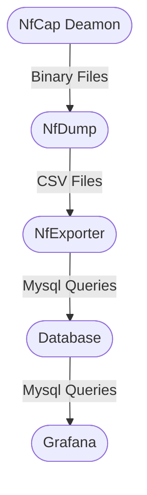

# netdump-appliance

Descrição dos campos: 

ts: Timestamp de início da conexão.
te: Timestamp de término da conexão.
td: Tempo de duração da conexão.
sa: Endereço IP de origem.
da: Endereço IP de destino.
sp: Porta de origem.
dp: Porta de destino.
pr: Protocolo utilizado na conexão.
flg: Flags da conexão.
fwd: Informação sobre a conexão ser encaminhada ou não.
stos: Tipo de serviço do IP.
ipkt: Número de pacotes de entrada.
ibyt: Número de bytes de entrada.
opkt: Número de pacotes de saída.
obyt: Número de bytes de saída.
in: Interface de rede de entrada.
out: Interface de rede de saída.
sas: Endereço IP de origem da conexão.
das: Endereço IP de destino da conexão.
smk: Máscara de sub-rede de origem.
dmk: Máscara de sub-rede de destino.
dtos: Tipo de serviço do IP de destino.
dir: Direção da conexão.
nh: Próximo salto.
nhb: Próximo salto BGP.
svln: VLAN de origem.
dvln: VLAN de destino.
ismc: Contador de endereços IP multicast de origem.
odmc: Contador de endereços IP multicast de destino.
idmc: Endereço IP multicast de origem.
osmc: Endereço IP multicast de destino.
mpls1 a mpls10: Rótulos MPLS.
cl: Classe de conexão.
sl: Subclasse de conexão.
al: Afirmação de conexão.
ra: Endereço IP do roteador de saída.
eng: Engenharia de tráfego.
exid: ID de exportação.
tr: Timestamp da exportação.